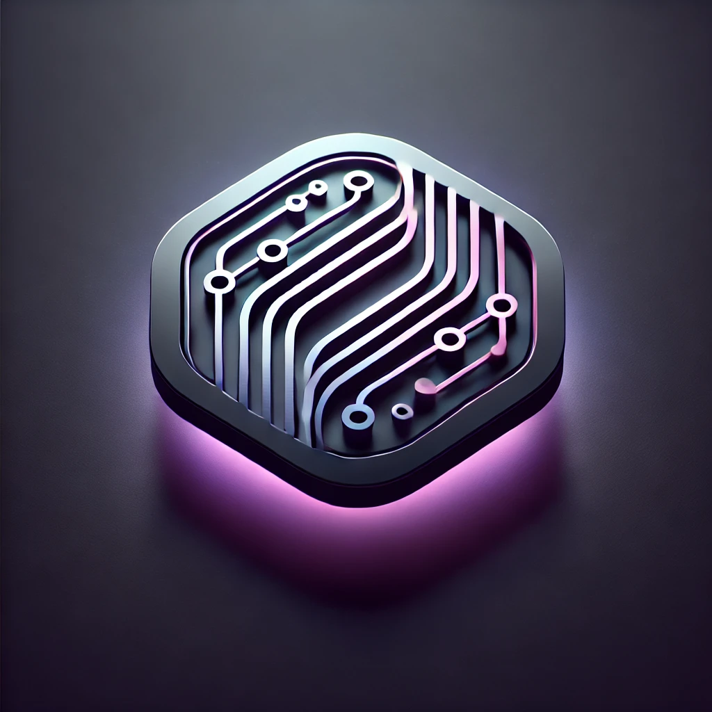
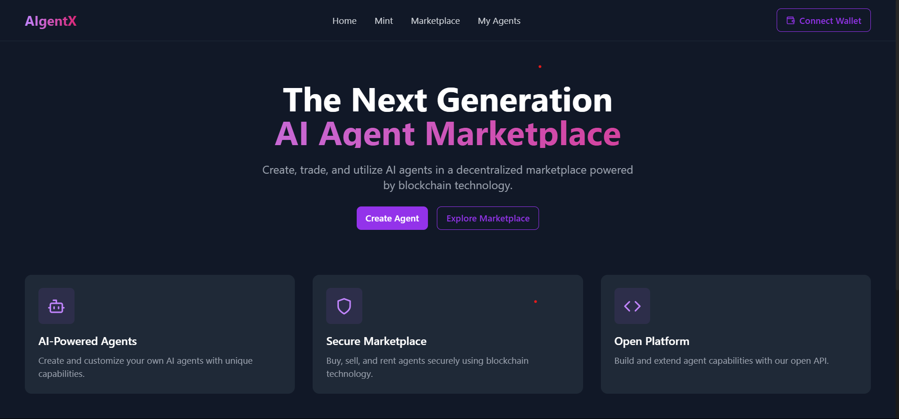

# AIgentX






## Table of Contents 

- [AIgentX](#aigentx)
  - [Table of Contents](#table-of-contents)
  - [Project Idea](#project-idea)
  - [Our Approach](#our-approach)
  - [Architecture](#architecture)
  - [Technologies We Used](#technologies-we-used)
    - [FastAPI Backend](#fastapi-backend)
    - [Coinbase CDP](#coinbase-cdp)
    - [The Graph Integration](#the-graph-integration)
    - [Walrus Storage](#walrus-storage)
    - [Base Chain](#base-chain)
  - [Key Features](#key-features)
  - [Challenges we Faced](#challenges-we-faced)
  - [Installation and Setup Guide](#installation-and-setup-guide)
    - [Frontend Setup](#frontend-setup)
    - [Backend Setup](#backend-setup)
    - [The Graph Setup](#the-graph-setup)
    - [Walrus Configuration](#walrus-configuration)
  - [Team Members](#team-members)

## Project Idea
Decentralized Marketplace for AI agents with autonomous capabilities and true ownership.

We're creating the first-ever decentralized marketplace for AI agents where creation is as simple as a conversation. Why rely on pre-built AI tools when you can create, customize, and monetize your own AI agents?

Each agent is equipped with its own wallet and can operate autonomously, from executing trades to managing digital assets. The agents can be rented or sold, creating a new paradigm for AI ownership and monetization.

This vision is enhanced by our natural language interface - simply describe what you want, and our platform creates a custom AI agent ready for deployment on the blockchain.

## Our Approach
- **Natural Language Creation**: Create AI agents through simple conversation
- **Autonomous Operation**: Each agent has its own wallet and decision-making capabilities
- **Dual Monetization**: Rent or sell your agents on the marketplace
- **Community Driven**: Rating system ensures quality and reliability
- **Decentralized Data Management**: Utilizing The Graph for querying and Walrus for storage

## Architecture 


Our architecture combines multiple cutting-edge technologies:

1. **Frontend Layer**: React-based interface with Web3 integration
2. **Backend Services**: FastAPI server handling agent creation and management
3. **Blockchain Layer**: Smart contracts on Base Chain
4. **Data Layer**: The Graph for indexing and Walrus for storage
5. **Integration Layer**: Coinbase CDP for wallet management

## Technologies We Used

Here's how we have used various technologies to make this project a reality:


### FastAPI Backend
Our high-performance backend handles agent creation and management, powered by FastAPI for lightning-fast response times and efficient processing of natural language inputs.

### Coinbase CDP
Coinbase Cloud Development Platform provides the robust infrastructure needed for secure wallet creation and management for each AI agent.

### The Graph Integration
The Graph protocol is integral to our platform's data querying capabilities:
- **Real-time Indexing**: Automatically indexes all agent activities and marketplace transactions
- **Efficient Queries**: GraphQL endpoints for fetching agent data and market statistics
- **Custom Subgraphs**: Specialized subgraphs for tracking agent performance and user interactions
- **Event Tracking**: Monitors smart contract events for marketplace activities

### Walrus Storage
Walrus provides our decentralized storage solution with several key features:
- **Metadata Storage**: Secure storage for agent configurations and properties
- **Content Addressing**: Efficient retrieval of agent data using content-based addressing
- **Versioning**: Track changes in agent configurations over time
- **Access Control**: Granular permissions for agent data access
- **Data Persistence**: Reliable storage for long-term data availability

### Base Chain
Base blockchain provides the foundation for our smart contracts, enabling secure and efficient agent transactions and ownership management.

## Key Features

1. **Natural Language Agent Creation**
   - Voice and text input support
   - Multi-language compatibility
   - AI-powered agent customization

2. **Autonomous Agent Operations**
   - Individual wallet management
   - Automated trading capabilities
   - Self-executing smart contracts

3. **Marketplace Functions**
   - Rental system with daily pricing
   - Direct purchase options
   - Rating and review system
   - Automated revenue distribution

4. **Data Management**
   - Real-time transaction tracking via The Graph
   - Secure metadata storage with Walrus
   - Efficient query system for marketplace data

## Challenges we Faced

1. **Autonomous Agent Creation**: Developed a system for dynamic generation and deployment of AI agents with individual wallets and capabilities.

2. **Blockchain Integration**: Successfully implemented secure wallet management and transaction handling for autonomous agents.


## Installation and Setup Guide

1. Clone the repository:
bash
git clone https://github.com/yourusername/aigentx.git
cd aigentx
```

### Frontend Setup
```bash
# Navigate to frontend
cd frontend

# Install dependencies
npm install

# Create environment file
cp .env.example .env

# Start development server
npm run dev
```

### Backend Setup
```bash
# Navigate to backend
cd backend

# Install dependencies
pip install -r requirements.txt

# Configure environment
cp .env.example .env

# Start the server
python main.py
```

### The Graph Setup
```bash
# Install Graph CLI
npm install -g @graphprotocol/graph-cli

# Initialize and create a new subgraph
graph init --studio aigentx

# Generate code and build
graph codegen && graph build

# Deploy to The Graph Studio
graph deploy --studio aigentx
```

### Walrus Configuration
```bash
# Choose a public aggregator from the list below
export WALRUS_AGGREGATOR_URL="https://aggregator.walrus-testnet.walrus.space"

# Choose a public publisher from the list below
export WALRUS_PUBLISHER_URL="https://publisher.walrus-testnet.walrus.space"

# For testing purposes (up to 10 MiB files)
# No authentication required for public endpoints
```

Available Public Aggregators (Testnet):
- https://aggregator.walrus-testnet.walrus.space
- https://wal-aggregator-testnet.staketab.org
- https://walrus-testnet-aggregator.bartestnet.com
- https://walrus-testnet.blockscope.net
- [View full list](https://docs.walrus.space/public-endpoints)

Available Public Publishers (Testnet):
- https://publisher.walrus-testnet.walrus.space
- https://wal-publisher-testnet.staketab.org
- https://walrus-testnet-publisher.bartestnet.com
- [View full list](https://docs.walrus.space/public-endpoints)

> **Note**: Public publishers have a 10 MiB file size limit. For larger files, consider running your own publisher or using the CLI. Mainnet deployment would require authentication and compensation for SUI and WAL tokens used.


### Now Setup your .env accordingly
## Team Members

[Suyash Nahar](https://github.com/suyash101101)

[Vatsal Jay Gandhi](https://github.com/vg239)

[Vishruth Srivatsa](https://devfolio.co/@marcdhi)

[Shivam Kumar A](https://github.com/Shivam-kum-mhta)

[Kush Anchaliya](https://devfolio.co/@marcdhi)
``````</rewritten_file>